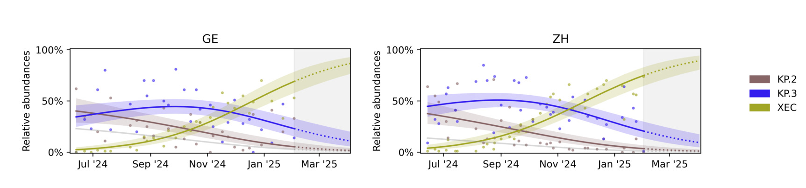

[](https://www.repostatus.org/#active)
[](https://github.com/cbg-ethz/covvfit/actions/workflows/test.yml)
[](https://github.com/charliermarsh/ruff)
[](https://github.com/psf/black)
[](https://pypi.org/project/covvfit/)
[](https://doi.org/10.5281/zenodo.15085753)
[](https://doi.org/10.1016/j.watres.2026.126018)

# covvfit



Fitness estimates of SARS-CoV-2 variants from variant abundance data.

  - **Documentation:** [https://cbg-ethz.github.io/covvfit](https://cbg-ethz.github.io/covvfit)
  - **Source code:** [https://github.com/cbg-ethz/covvfit](https://github.com/cbg-ethz/covvfit)
  - **Bug reports:** [https://github.com/cbg-ethz/covvfit/issues](https://github.com/cbg-ethz/covvfit/issues)
  - **Publication:** [https://doi.org/10.1016/j.watres.2026.126018](https://doi.org/10.1016/j.watres.2026.126018)

## Installation and usage

*Covvfit* can be installed from the Python Package Index:

```bash
$ pip install covvfit
```

For an example how to analyze the data see [this tutorial](https://cbg-ethz.github.io/covvfit/cli/).


## References

This method accompanies our manuscript:

David Dreifuss, Paweł Czyż, Niko Beerenwinkel, *Learning and forecasting selection dynamics of SARS-CoV-2 variants from wastewater sequencing data using Covvfit*, Water Research, 2026, doi: [https://doi.org/10.1016/j.watres.2026.126018](https://doi.org/10.1016/j.watres.2026.126018).


```bibtex
@article{Dreifuss2026-Covvfit,
    title = {Learning and forecasting selection dynamics of SARS-CoV-2 variants from wastewater sequencing data using Covvfit},
    author = {David Dreifuss and Paweł Czyż and Niko Beerenwinkel},
    journal = {Water Research},
    pages = {126018},
    year = {2026},
    issn = {0043-1354},
    doi = {https://doi.org/10.1016/j.watres.2026.126018},
    url = {https://www.sciencedirect.com/science/article/pii/S0043135426006998},
    keywords = {wastewater based epidemiology, wastewater surveillance, evolutionary dynamics, Pandemic preparedness},
    abstract = {The COVID-19 pandemic has been driven by the emergence and spread of SARS-CoV-2 variants that confer a selective advantage over previously circulating strains. Estimating these selective advantages typically involves analyzing a large number of positive test samples through genomic sequencing. In this study, we present Covvfit, a statistical model and software package for estimating the fitness advantages of multiple competing variants using sequencing data derived from wastewater samples from different locations. We use our model to reconstruct the dynamics of variant competition across successive waves of the pandemic using over 5,000 samples from wastewater sequencing data collected between 2021 and 2025. We show through a comparison with clinical data that wastewater-based estimates of fitness advantages are efficient and accurate. Furthermore, we demonstrate that once variants surpass a low detection threshold, Covvfit can accurately predict their future dynamics over prediction horizons of up to 90 days.}
}

```


## See Also

  - [V-pipe](https://cbg-ethz.github.io/V-pipe/): a bioinformatics pipeline for viral sequencing data.
  - [cojac](https://github.com/cbg-ethz/cojac): command-line tools for the analysis of co-occurrence of mutations on amplicons.

