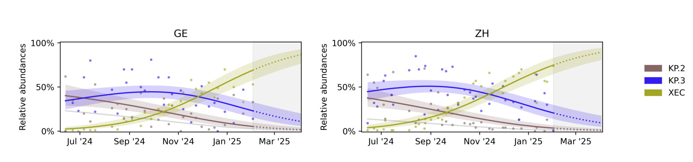

# Command line workflow

We assume that the *Covvfit* tool has been installed properly (see the [installation guide](./installation.md)).
*Covvfit* takes as an input a data frame containing deconvolved values.
Below we describe how to download an example data set.

However, if you have your own data, you can deconvolve them using the following tools:

  - *LolliPop*: follow [these instructions](running_deconv/lollipop.md) on how to run *LolliPop*. (Note that the smoothing can bias the results, so you may need to deconvolve the data again, if you used smoothing.)
  - *Freyja*: follow [these instructions](running_deconv/freyja.md) to assemble the outputs into a data frame.

In this tutorial we will work with example data, which have already been deconvolved and assembled into a suitable data frame.

## The data

What is the suitable data? We assemble the deconvolved variant abundance estimates into a data frame with four columns,
representing *location* (the region or city where the data were obtained), *date* (when the sample was collected), *variant* and deconvolved *proportions*.

Example data can therefore look as follows:
```yaml
location  variant  date        proportion
GE        KP.2	   2025-02-04  0.363
GE	      KP.3	   2025-02-04  0.141
GE	      XEC      2025-02-04  0.326
ZH	      KP.2     2025-02-09  0.251
ZH	      XEC      2025-02-09  0.507
```

where `location` column refers to Geneva or Zurich treatment plants, `variant` represent variant name corresponding to the right `proportion` obtained from a sample collected at date `date`. 
Note that a single deconvolved sample corresponds to several rows in a data frame, representing the abundance estimates for different variants on that day.

    
The example data can be downloaded from [this link](https://drive.google.com/drive/folders/1cvgPpGRgC69nutpkeGReo5NnULe0Ovil?usp=sharing).
Create the new directory and save the data there as `example-data.tsv`.
A larger data set, which was used in the publication, is [available on Zenodo](https://doi.org/10.5281/zenodo.15085753).

## Running *Covvfit*

We have installed the package and downloaded the data.
Using the [`cd`](https://en.wikipedia.org/wiki/Cd_(command)) command, navigate to the directory where the data have been downloaded.
We can run the tool using:

```bash
$ covvfit infer --input example-data.tsv --output example-output -v KP.2 -v KP.3 -v XEC
```

After a few seconds, we should see a new directory, `example-output`, containing the analysis results.
To interpret the arguments provided to the tool:

  - `--input`: the file with example data;
  - `--output`: the directory that the tool will create and populate with the analysis results;
  - `-v`: used to specify the investigated variants. All the variants not included in the list are merged into an "other" variant.  

What files in the `example-output` directory were created? By default, we should see the following:

  - `figure.pdf` (or `figure.png`): the figure with the fit to the available data as well as forecasts;
  - `results.yaml`: the relative fitness advantages of different variants in the analysis over the "other" variant;
  - `pairwise_fitnesses.csv`: the relative fitness advantages between each pair of variants.
  - `log.txt`: log of the computations performed by the tool.

### Interpreting the figure

The figure will look as follows:



We see the variant abundances for each location, together with the model fit, as well as model predictions over the coming weeks (marked with dashed lines in the shaded region).

## More control over input arguments

The above example is very simple, as the example data have been formatted according to our default naming conventions. How can we run the tool on the data which is formatted differently? For example, it's not a TSV file (separated using the TAB character), but rather a CSV file (separated using the comma)? Or the column names are different?

We can control these settings using additional arguments. We can print help using:

```bash
$ covvfit infer --help
```

which prints the following message:

```md                                                                                                                                                                                                                                             
 Usage: covvfit infer [OPTIONS]                                                                                                                                                                                                               
                                                                                                                                                                                                                                              
 Runs growth advantage inference.                                                                                                                                                                                                                                                                                                                                                                                                                        
╭─ Options ──────────────────────────────────────────────────────────────────────────────────────────────────────────────────────────────────────────────────────────────────────────────────────────────────────────────────────────────────╮
│ *  --input             -i      TEXT     CSV with deconvolved data [default: None] [required]                                                                                                                                               │
│ *  --output            -o      TEXT     Output directory [default: None] [required]                                                                                                                                                        │
│    --config            -c      TEXT     Path to the YAML file with configuration. [default: None]                                                                                                                                          │
│    --var               -v      TEXT     Variant names to be included in the analysis. Note: overrides the settings in the config file (--config). [default: None]                                                                          │
│    --loc               -l      TEXT     Location names to be included in the analysis. Note: overrides the settings in the config file (--config). [default: None]                                                                         │
│    --separator         -s      TEXT     Data separator used to read the input file. By default read from the config file (if not specified, the TAB character). [default: None]                                                            │
│    --max-days                  INTEGER  Number of the past dates to which the analysis will be restricted [default: 240]                                                                                                                   │
│    --date-min                  TEXT     Minimum date to start load data in format YYYY-MM-DD. By default calculated using `--max_days` and `--date-max`. [default: None]                                                                   │
│    --date-max                  TEXT     Maximum date to finish loading data, provided in format YYYY-MM-DD. By default calculated as the last date in the CSV file. [default: None]                                                        │
│    --horizon                   INTEGER  Number of future days for which abundance prediction should be generated [default: 60]                                                                                                             │
│    --horizon-date              TEXT     Date until when the predictions should occur, provided in format YYYY-MM-DD. By default calculated using `--horizon` and `--date-max`. [default: None]                                             │
│    --time-spacing              INTEGER  Spacing between ticks on the time axis in months [default: None]                                                                                                                                   │
│    --variant-col               TEXT     Name of the column representing observed variant [default: variant]                                                                                                                                │
│    --proportion-col            TEXT     Name of the column representing observed proportion [default: proportion]                                                                                                                          │
│    --date-col                  TEXT     Name of the column representing measurement date [default: date]                                                                                                                                   │
│    --location-col              TEXT     Name of the column with spatial location [default: location]                                                                                                                                       │
│    --help                               Show this message and exit.                                                                                          
╰────────────────────────────────────────────────────────────────────────────────────────────────────────────────────────────────────────────────────────────────────────────────────────────────────────────────────────────────────────────╯
```

We see that the separator can be changed by using the `--separator` (or `-s` for short) argument. Similarly, the column names can be set using `--variant-col`, `--proportion-col` etc. argument

### Navigating space and time

Similarly as `-v` controls the list of variants in the analysis, the `--loc` flag controls the locations included. If no `--loc` flag is specified, we use all the locations found in the data frame (in the example above, it is equivalent to `--loc GE --loc ZH`).
However, to restrict the analysis only to the data from Geneva, you can run `--loc GE`.

Additionally, one can control the time range. Use e.g., `--date-min 2024-08-20` to load only the data collected on `2024-08-20` and onwards or `--date-max 2025-02-01` to truncate the data to `2025-02-01`. Note that the format used is `YYYY-MM-DD`.  
This utility can be useful to understand how much new data affect the predictions and the uncertainty.
Additionally, `--horizon-date YYYY-MM-DD` specifies the time interval for which the abundance prediction is issued.

However, for regular water surveillance efforts, it may be cumbersome to select the date ranges as specified above. Use `--max-days 240` to restrict the data to the newest sample and the 240 days of data collected before it. Similarly,`--horizon 60` specifies that the predictions should be issues for the 60 days after the last sample was collected.

Finally, `--time-spacing 2` controls that the ticks on the time axis in the plot should be spaced every two months. While this utility does not affect the analysis, it can significantly affect the plot readability.

## Using configuration files

Specifying a long list of variants using `-v` flag can be inconvenient. We can use a configuration file to specify it in a more convenient fashion.

Open a new file, `config.yaml` and specify the following:

```yaml
# This is the content of the config.yaml
variants:
  - KP.2
  - KP.3
  - XEC
```

Now we can run the tool using:

```bash
$ covvfit infer --input example-data.tsv --output example-output-with-config --config config.yaml
```

so that the tool will load the variants from `config.yaml`!

In fact, `config.yaml` can be used to achieve more fine-grained control the analysis and the output figure.


```yaml
variants:
- XEC
- KP.2
- KP.3
locations:
  - GE
  - ZH 
# Alternatively, comment out the `locations` above and uncomment the following line, to include all locations by default:
# locations: null
analysis:
  data_separator: "\t"
  n_starts: 10  # Number of restarts in the optimization
  other_threshold: null  # Specify to e.g., 0.7 to ignore the samples where "other" variant achieves at least 0.7 abundance
plot:
  backend: null  # Matplotlib backend.
  dimensions:    # Plot visuals
    bottom: 0.5
    dpi: 350
    hspace: 0.5
    left: 1.0
    panel_height: 1.5
    panel_width: 4.0
    right: 1.5
    top: 0.7
    wspace: 1.0
  dpi: 500       # Plot resolution
  extensions:    # Figure will be generated using the follosing extensions 
  - png
  - pdf
  prediction:
    linestyle: ':'
    region_alpha: 0.1
    region_color: grey
  time_spacing: 2          # The time spacing, can be overridden using the command line `--time-spacing` argument
  variant_colors:          # The colors of different variants
    KP.2: '#876566'
    KP.3: '#331eee'
    XEC: '#a2a626'
```
